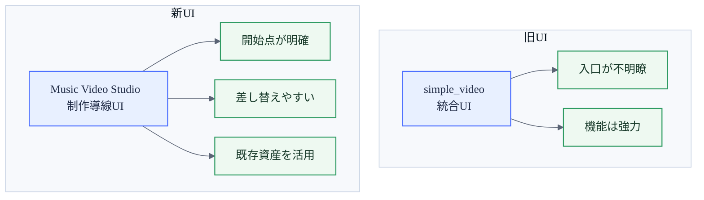
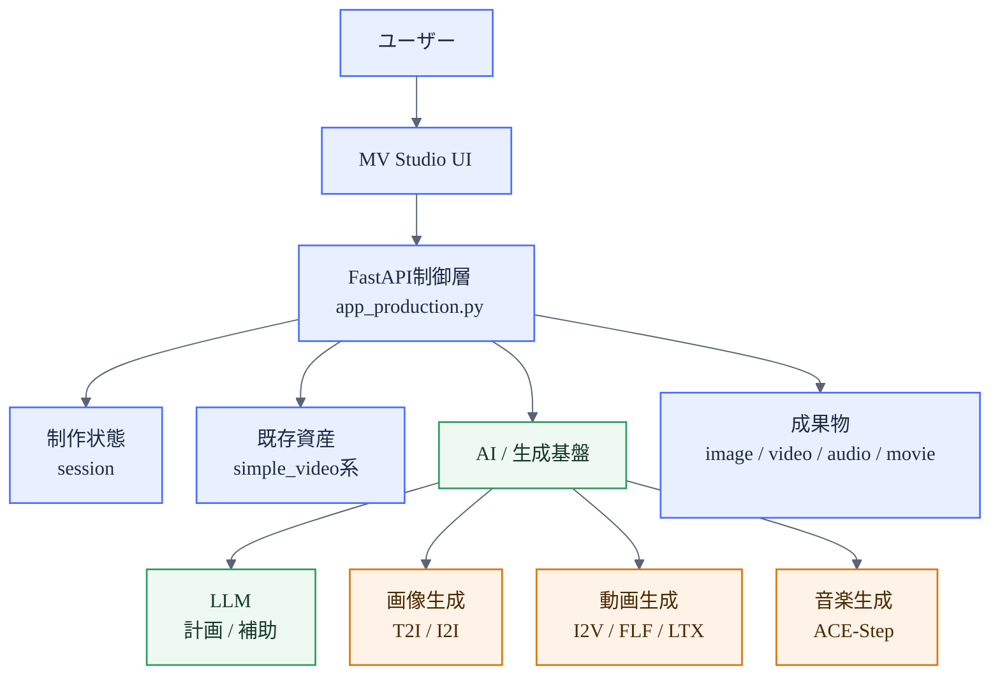
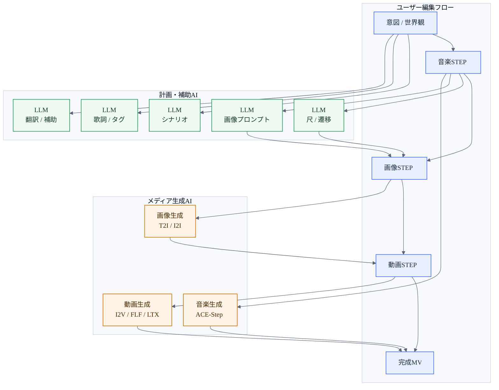
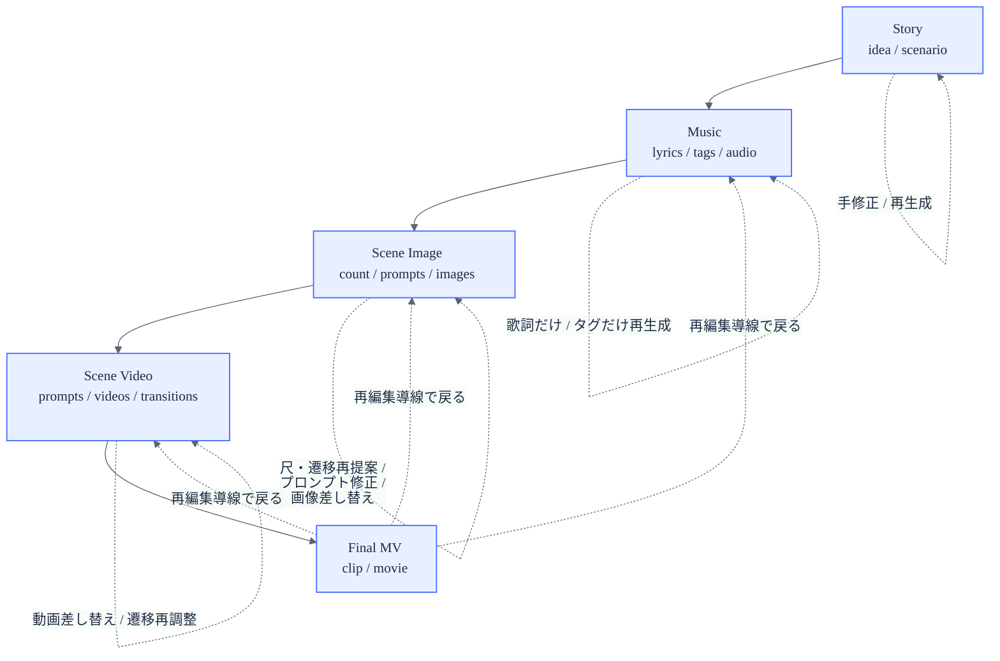
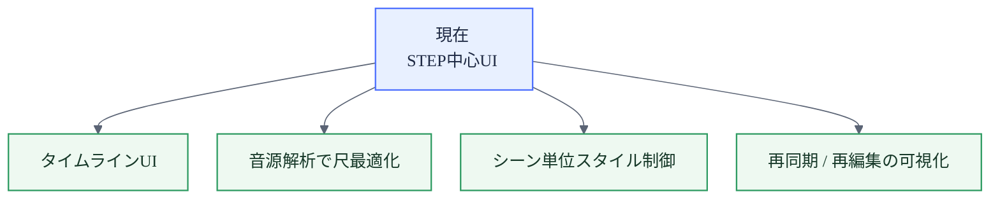

# Music Video Studio 図版集

最終更新: 2026-05-03

プレゼン資料から Mermaid 図だけを抜き出した、画像化・貼り付け向けの簡易版です。

白背景固定・16:9貼り込み向けの版は [lt/MV_STUDIO_PRESENTATION_DIAGRAMS_WHITE_JP.md](MV_STUDIO_PRESENTATION_DIAGRAMS_WHITE_JP.md) を参照してください。最初に作成した図は [lt/MV_STUDIO_PRESENTATION_DIAGRAMS_ORIGINAL_JP.md](MV_STUDIO_PRESENTATION_DIAGRAMS_ORIGINAL_JP.md) に保存しています。

関連資料:
- [lt/MV_STUDIO_PRESENTATION_JP.md](MV_STUDIO_PRESENTATION_JP.md)
- [lt/diagrams/README.md](diagrams/README.md)

---

## 01. UI責務の再設計

用途: 改善前後のUI責務の違いを1枚で説明する

ソース: [lt/diagrams/01_ui_responsibility_shift.mmd](diagrams/01_ui_responsibility_shift.mmd)

---

## 02. 継承型アーキテクチャ

用途: 新UIと既存資産の継承関係を説明する

ソース: [lt/diagrams/02_system_layers.mmd](diagrams/02_system_layers.mmd)

---

## 03. AIの役割分担

用途: 計画AIとメディア生成AIの役割分担を説明する

ソース: [lt/diagrams/03_ai_usage_map.mmd](diagrams/03_ai_usage_map.mmd)

---

## 04. STEPは介入点

用途: STEPごとの介入可能ポイントを説明する

ソース: [lt/diagrams/04_step_dataflow.mmd](diagrams/04_step_dataflow.mmd)

---

## 05. 制作OSへの進化

用途: 拡張ロードマップを短く示す

ソース: [lt/diagrams/05_roadmap.mmd](diagrams/05_roadmap.mmd)
