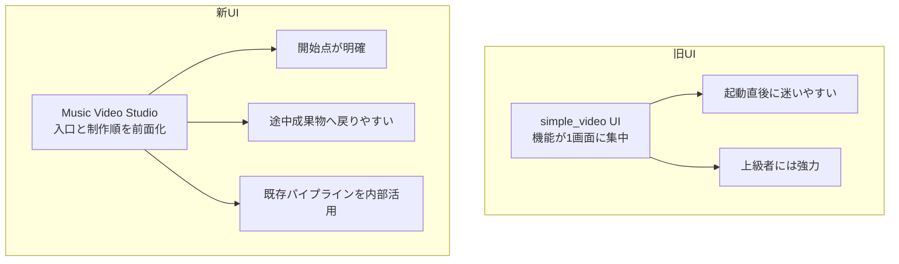
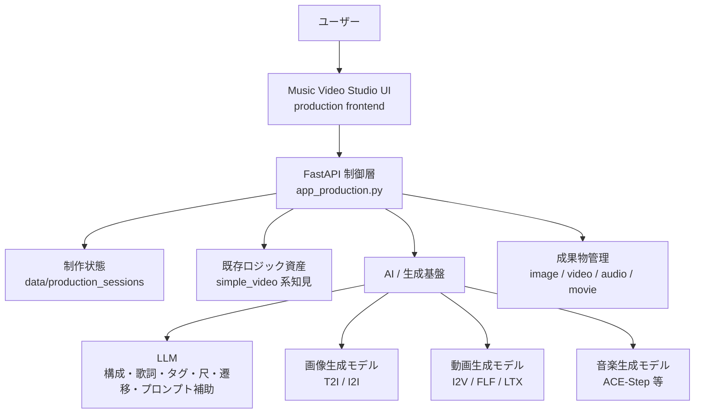
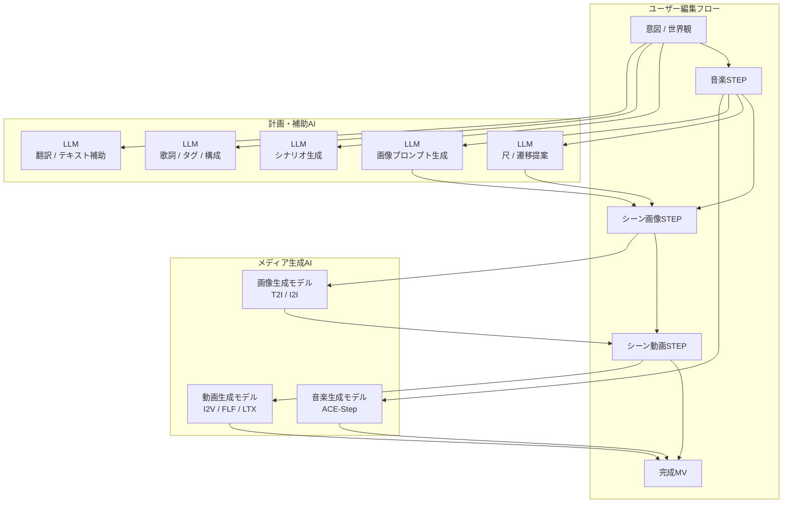
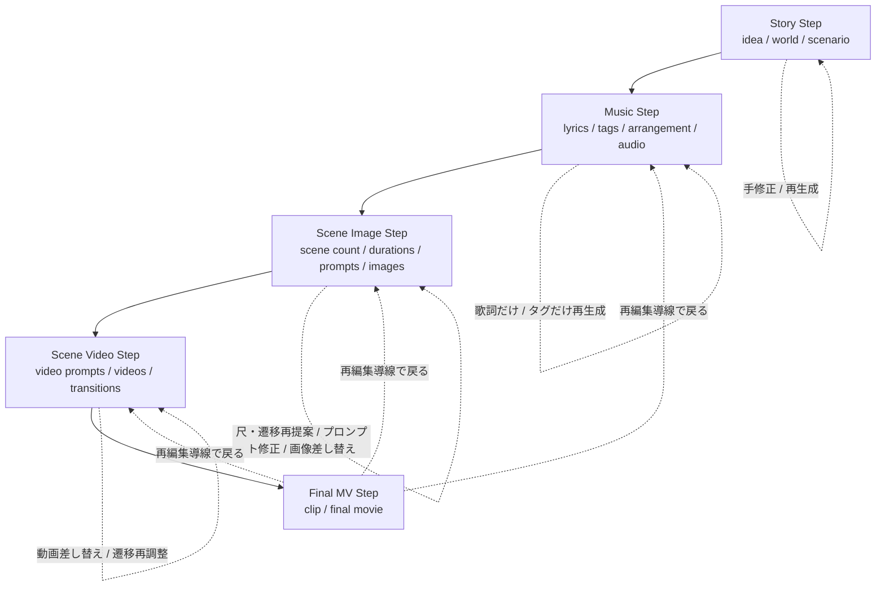
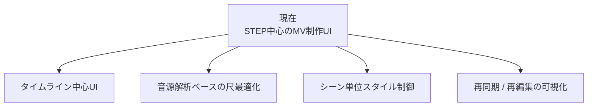

# Music Video Studio 図版集（初版）

最終更新: 2026-05-03

最初に作成した Mermaid 図を、そのまま保持するための保存版です。

関連資料:
- [lt/MV_STUDIO_PRESENTATION_JP.md](MV_STUDIO_PRESENTATION_JP.md)
- [lt/MV_STUDIO_PRESENTATION_DIAGRAMS_JP.md](MV_STUDIO_PRESENTATION_DIAGRAMS_JP.md)
- [lt/MV_STUDIO_PRESENTATION_DIAGRAMS_WHITE_JP.md](MV_STUDIO_PRESENTATION_DIAGRAMS_WHITE_JP.md)
- [lt/diagrams/original/README.md](diagrams/original/README.md)

---

## 01. 旧UIから新UIへの責務移動

ソース: [lt/diagrams/original/01_ui_responsibility_shift_original.mmd](diagrams/original/01_ui_responsibility_shift_original.mmd)

---

## 02. システム層構造

ソース: [lt/diagrams/original/02_system_layers_original.mmd](diagrams/original/02_system_layers_original.mmd)

---

## 03. AI使用箇所の全体像

ソース: [lt/diagrams/original/03_ai_usage_map_original.mmd](diagrams/original/03_ai_usage_map_original.mmd)

---

## 04. データフローと介入点

ソース: [lt/diagrams/original/04_step_dataflow_original.mmd](diagrams/original/04_step_dataflow_original.mmd)

---

## 05. 今後の進化方向

ソース: [lt/diagrams/original/05_roadmap_original.mmd](diagrams/original/05_roadmap_original.mmd)
