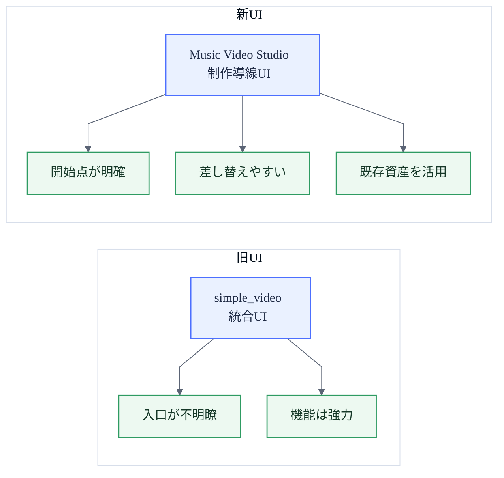
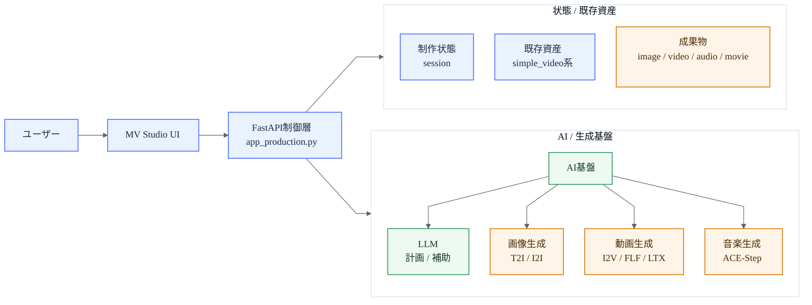
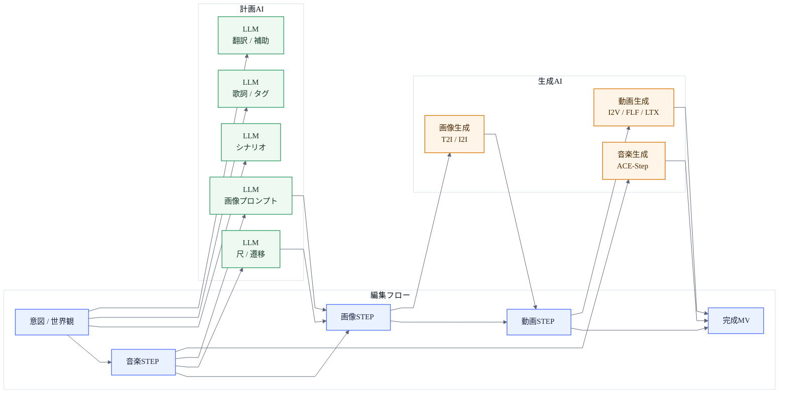
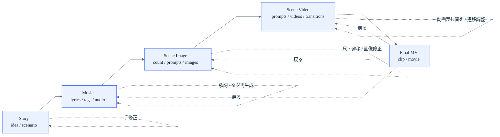
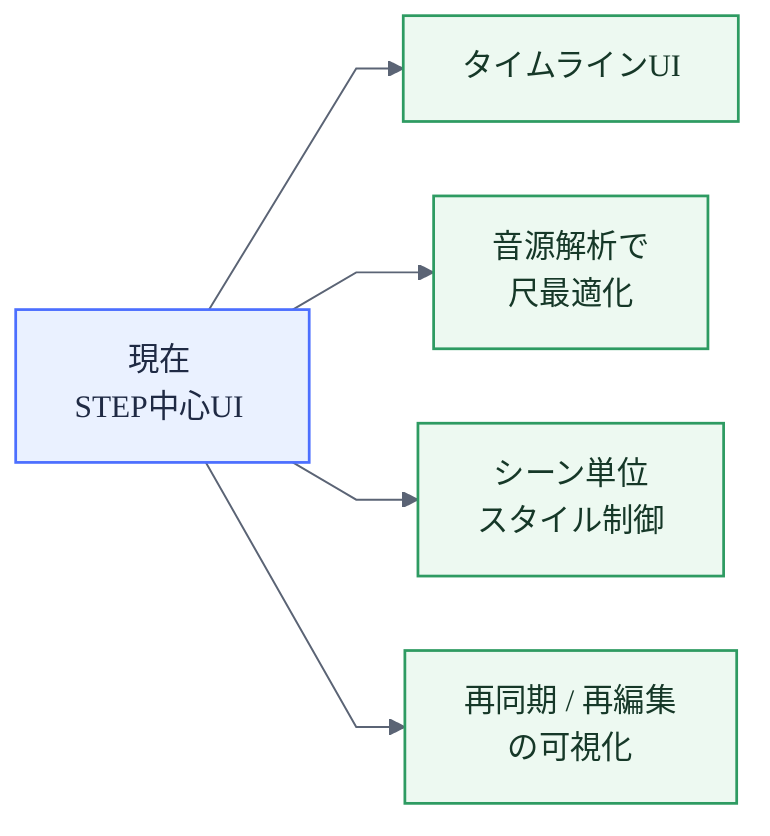

# Music Video Studio 図版集（白背景固定版）

最終更新: 2026-05-03

PNG書き出しと 16:9 スライド貼り込みを前提に、白背景固定・横長寄りで整えた Mermaid 図版集です。

最初に作成した図は [lt/MV_STUDIO_PRESENTATION_DIAGRAMS_ORIGINAL_JP.md](MV_STUDIO_PRESENTATION_DIAGRAMS_ORIGINAL_JP.md) に保存しています。

関連資料:
- [lt/MV_STUDIO_PRESENTATION_JP.md](MV_STUDIO_PRESENTATION_JP.md)
- [lt/MV_STUDIO_PRESENTATION_DIAGRAMS_JP.md](MV_STUDIO_PRESENTATION_DIAGRAMS_JP.md)
- [lt/diagrams/README.md](diagrams/README.md)

---

## 01. UI責務の再設計

ソース: [lt/diagrams/white/01_ui_responsibility_shift_white.mmd](diagrams/white/01_ui_responsibility_shift_white.mmd)

---

## 02. 継承型アーキテクチャ

ソース: [lt/diagrams/white/02_system_layers_white.mmd](diagrams/white/02_system_layers_white.mmd)

---

## 03. AIの役割分担

ソース: [lt/diagrams/white/03_ai_usage_map_white.mmd](diagrams/white/03_ai_usage_map_white.mmd)

---

## 04. STEPは介入点

ソース: [lt/diagrams/white/04_step_dataflow_white.mmd](diagrams/white/04_step_dataflow_white.mmd)

---

## 05. 制作OSへの進化

ソース: [lt/diagrams/white/05_roadmap_white.mmd](diagrams/white/05_roadmap_white.mmd)
