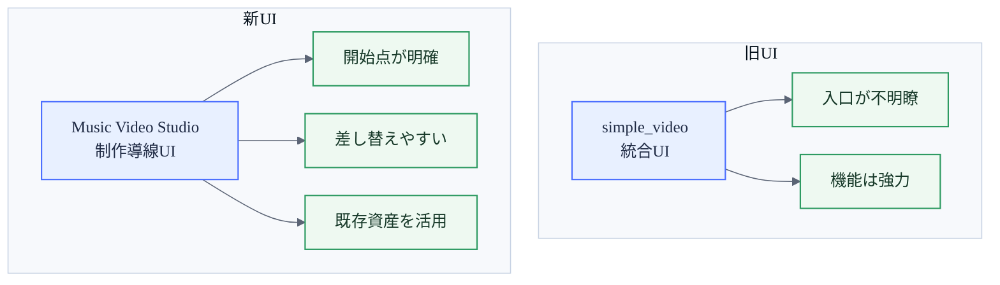
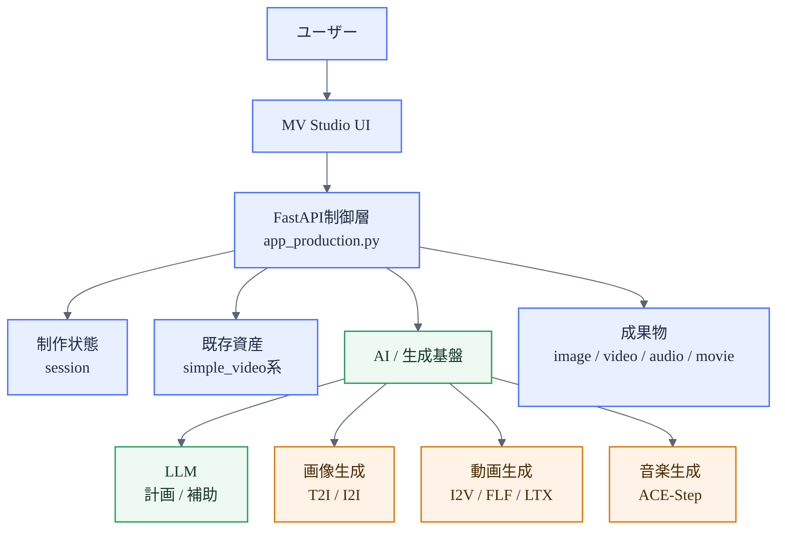
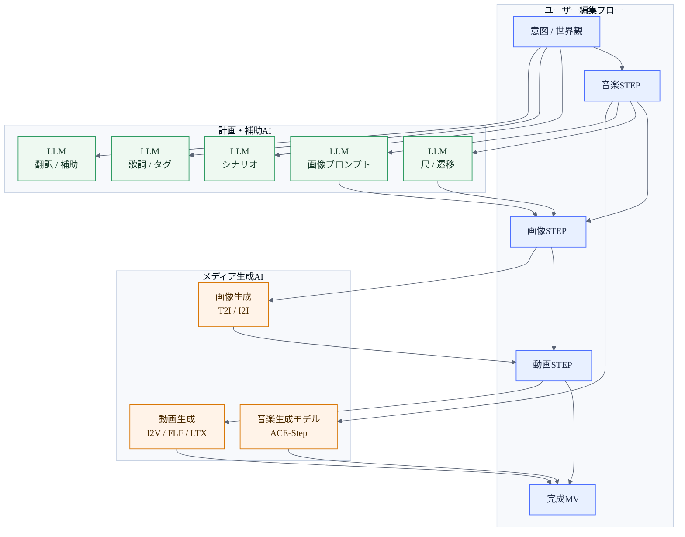
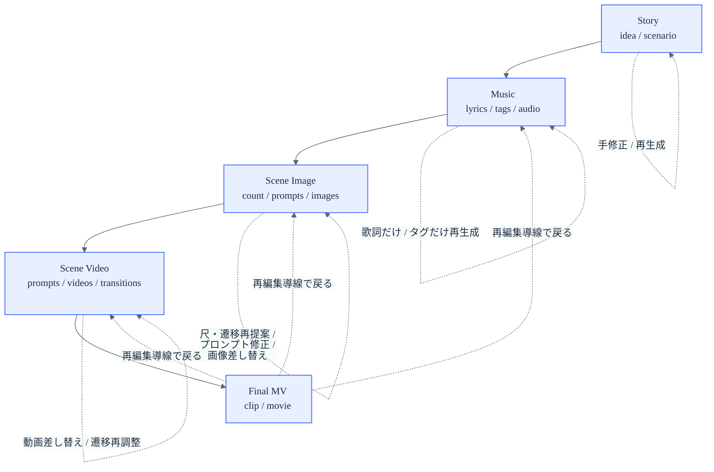
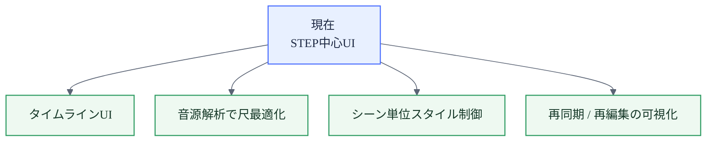

# Music Video Studio プレゼン資料（技術者向け・図解入り）

最終更新: 2026-05-03

本資料は、既存 `simple_video` 系UIから `Music Video Studio` へ進化したポイントを、技術者向けに約5枚で説明するためのドラフトです。

図だけを1枚ずつ使いたい場合は、[lt/MV_STUDIO_PRESENTATION_DIAGRAMS_JP.md](MV_STUDIO_PRESENTATION_DIAGRAMS_JP.md) を参照してください。PNG貼り込み向けの白背景版は、[lt/MV_STUDIO_PRESENTATION_DIAGRAMS_WHITE_JP.md](MV_STUDIO_PRESENTATION_DIAGRAMS_WHITE_JP.md) に分離しています。最初に作成した図は、[lt/MV_STUDIO_PRESENTATION_DIAGRAMS_ORIGINAL_JP.md](MV_STUDIO_PRESENTATION_DIAGRAMS_ORIGINAL_JP.md) に保存しています。

参照元:

- [docs/MUSIC_VIDEO_STUDIO_JP.md](../docs/MUSIC_VIDEO_STUDIO_JP.md)
- [docs/MV_STUDIO_PLAN_JP.md](../docs/MV_STUDIO_PLAN_JP.md)
- [docs/MV_STUDIO_PRESET_MAPPING_JP.md](../docs/MV_STUDIO_PRESET_MAPPING_JP.md)
- [docs/TECHNICAL_ARTICLE_JP.md](../docs/TECHNICAL_ARTICLE_JP.md)

---

## 1枚目: 制作導線の再設計

### タイトル
高機能UIからMV導線UIへ

### 背景
- 旧 `simple_video` は、画像生成・動画生成・音楽生成・ファイル管理が1画面に集約された強力な統合UIだった
- 一方で、起動直後の体験としては「最初に何をすべきか」が伝わりづらかった
- 特に MV 制作では、素材生成よりも **制作フローの理解** と **途中介入** が重要になる

### 改善ポイント
- 入口を「新規制作 / STEP制作 / 既存素材編集」に整理
- UIを「機能一覧」から「制作フロー中心」に変更
- `simple_video` の既存プリセット群は破棄せず、**内部パイプライン資産**として再利用
- STEP を実行単位ではなく **介入ポイント / 編集ポイント** として再定義

### 図解: 旧UIから新UIへの責務移動

別ファイル: [lt/diagrams/01_ui_responsibility_shift.mmd](diagrams/01_ui_responsibility_shift.mmd)

### 技術メッセージ
改善の本質は「モデル変更」ではなく、**オーケストレーション層とUX層の再設計** である

---

## 2枚目: 継承型アーキテクチャ

### タイトル
新UI、旧資産を継承

### 要点
- 新GUIの中心は [app_production.py](../app_production.py)
- フロントは [static/music_video_studio.html](../static/music_video_studio.html), [static/js/music_video_studio.js](../static/js/music_video_studio.js), [static/css/music_video_studio.css](../static/css/music_video_studio.css)
- 旧系の [app.py](../app.py), [static/js/simple_video.js](../static/js/simple_video.js) は互換資産として維持
- つまり「旧システムを捨てた」のではなく、**新しい制御レイヤを上に載せた** 形に近い

### 図解: システム層構造

別ファイル: [lt/diagrams/02_system_layers.mmd](diagrams/02_system_layers.mmd)

### 技術メッセージ
`Music Video Studio` は新しい生成器ではなく、**既存生成器群をMV制作フローに再配置する制御面** である

---

## 3枚目: AIの役割分担

### タイトル
考えるAIと作るAIを分離

### 重要な整理
本アプリでは AI の役割を大きく2系統に分けている。

1. **計画・変換系AI（LLM）**
   - シナリオ生成
   - 歌詞生成
   - 音楽タグ提案
   - シーン尺提案
   - 遷移提案
   - シーン画像プロンプト生成
   - 翻訳・補助テキスト生成

2. **メディア生成系AI**
   - シーン画像生成
   - シーン動画生成
   - 音楽生成
   - 音声部分再生成（リペイント）

### 図解: AI使用箇所の全体像

別ファイル: [lt/diagrams/03_ai_usage_map.mmd](diagrams/03_ai_usage_map.mmd)

### 実装上の意味
- LLM は「曖昧な制作意図を、構造化された次工程入力へ変換」する
- 生成モデルは「確定した入力をメディアへレンダリング」する
- その間にユーザーが介入できるため、AIをブラックボックス化していない

### 技術メッセージ
AIの使い方は一括自動化ではなく、**段階的な意味変換 + メディア生成の分離** である

---

## 4枚目: STEPは介入点

### タイトル
STEPは中間状態の観測点

### 要点
- 入口プリセット: 何を作るか
- パイプラインプリセット: どう実行するか
- STEP: どこに介入するか

この分離により、以下が可能になる。

- シナリオだけ再生成
- 歌詞だけ再生成
- タグだけ再生成
- シーン尺 / 遷移だけ再提案
- シーン画像だけ差し替え
- シーン動画だけ再生成

### 図解: データフローと介入点

別ファイル: [lt/diagrams/04_step_dataflow.mmd](diagrams/04_step_dataflow.mmd)

### 技術メッセージ
この構造は、長い生成チェーンを分割して **再実行コストを局所化** するために重要

---

## 5枚目: 制作OSへの進化

### タイトル
生成UIから制作OSへ

### 技術的な価値
- **UI層の再設計** により、AI機能を段階的に理解できる
- **状態管理** により、中間成果物を保持したまま再編集できる
- **既存パイプライン資産の活用** により、全面作り直しを避けつつ改善できる
- **責務分離** により、LLM変更・画像モデル変更・動画モデル変更を局所化できる

### 今後の拡張候補
- タイムライン風UI
- 音源解析ベースのシーン長最適化
- シーンごとの画風・動画質感の上書き
- 再同期フローの可視化

### 図解: 今後の進化方向

別ファイル: [lt/diagrams/05_roadmap.mmd](diagrams/05_roadmap.mmd)

### 締めのメッセージ
`Music Video Studio` の価値は、生成性能そのものよりも、**AIを制作プロセスへ配置し直したこと** にある

---

## 発表者メモ（技術者向け）

### 1枚目で話すこと
- 旧UIの問題は「機能不足」ではなく「制作入口の未整理」だった
- そのため、新規モデル追加より先にUI / 状態 / 導線を再設計した

### 2枚目で話すこと
- 新旧の関係は断絶ではなく継承
- `app_production.py` が新しい制御面である

### 3枚目で話すこと
- AIを1つの箱として説明せず、LLM と生成モデルで役割を分けて説明する
- ここが最も理解を得やすいスライド

### 4枚目で話すこと
- STEPはパイプライン分解ではなく中間状態管理のためのUX
- 途中差し替え可能性が、MV制作では特に重要

### 5枚目で話すこと
- 今後はタイムライン / 音源同期 / シーン制御へ進む
- 本アプリは生成デモではなく、制作支援環境へ向かっている

---

## 使い方メモ

- そのままMarkdownスライド原稿として使える
- Mermaid対応環境なら図をそのまま表示可能
- PowerPointへ移す場合は、各スライドの「タイトル」「要点」「図解」を1枚ずつ分離して使う

